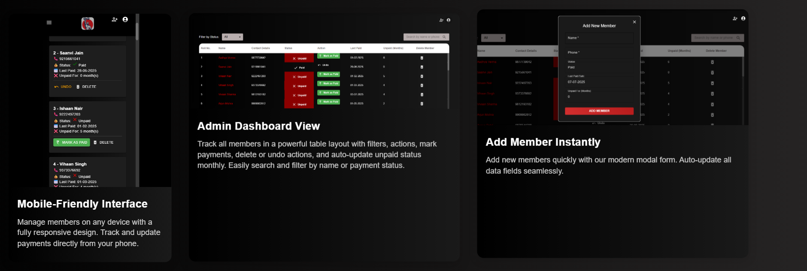

# Gym Fee Tracker

Full-stack web app to manage gym memberships, automate monthly fee tracking, and streamline member payment statuses.

## 🔍 Features
- 📝 Member registration
- 📅 Automatic monthly fee updates
- 💰 Fee status tracking (e.g., “2 months unpaid”)
- ✅ Mark as paid / ❌ Delete / 🔁 Undo
- 📦 Persistent data storage with MongoDB

---

## 📸 Preview

---

## 🔗 Live Demo

[Click here to try it out](https://gym-tracker-frontend-eight.vercel.app)

---

## 🛠️ Tech Stack

- React.js
- Material UI
- Node.js
- Express.js
- MongoDB
